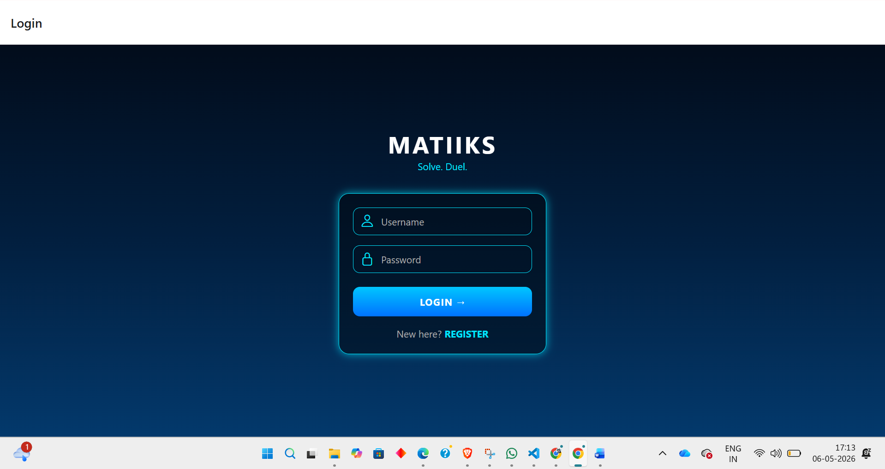
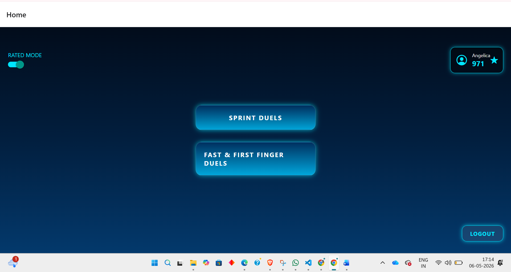
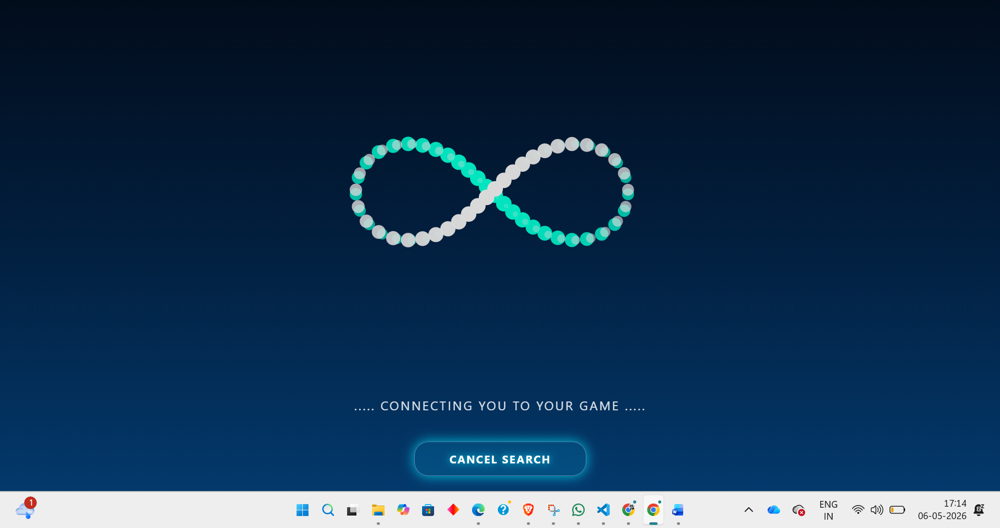
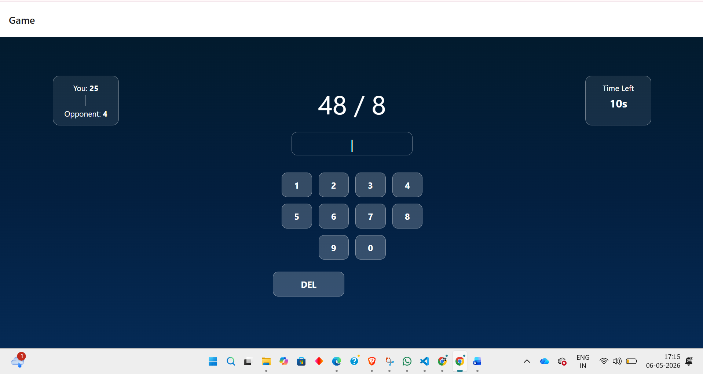
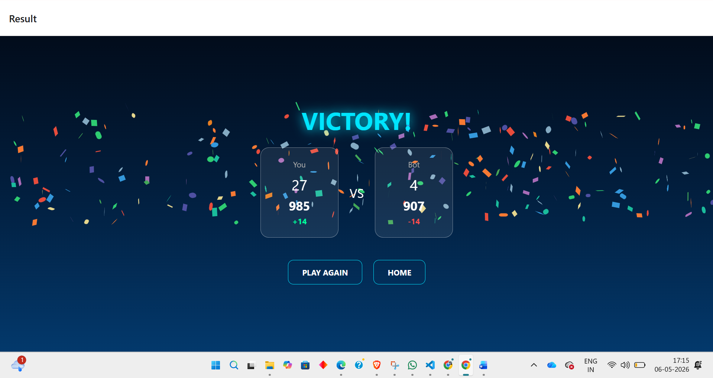

# MATIIKS — Rated vs Unrated Matchmaking Prototype for Competitive Learning

## Overview

MATIIKS is a realtime multiplayer math game prototype inspired by the MATIKS platform.

The project explores a specific product problem observed in MATIKS:

As player ratings increase, users often become more cautious about experimenting or casually exploring unfamiliar puzzle categories because losses affect their ranking.

For example, a player confident in KenKen may hesitate to try Cross Math despite being interested in it, since weaker performance could reduce their rating.

To address this, the prototype introduces a Rated vs Unrated Matchmaking System that allows players to choose whether they want competitive pressure or stress-free gameplay.

The project combines:

- realtime multiplayer systems
- event-driven architecture
- ELO-based progression
- mobile full-stack development
- matchmaking systems
- server-authoritative synchronization

while focusing on improving the overall gameplay experience.

---

# Core Prototype Idea

The prototype explores a simple idea:

Give players the flexibility to choose between:

- competitive ranked gameplay
- relaxed casual gameplay

This allows users to:

- practice safely
- experiment freely
- explore unfamiliar puzzle categories
- continue enjoying the platform without constant rating pressure

while still preserving the excitement of realtime multiplayer gameplay.

---

# Tech Stack

## Frontend

- React Native
- Expo
- React Navigation
- Socket.IO Client
- React Native Reanimated
- Expo Linear Gradient
- React Native SVG

## Backend

- Node.js
- Express.js
- Socket.IO
- MongoDB Atlas
- Mongoose

---

# Core Features

## Realtime Multiplayer Gameplay

Players compete against each other in realtime math duels using low-latency WebSocket communication.

---

## Rated vs Unrated Matchmaking

The system supports:

- Rated mode → ELO based competitive progression
- Unrated mode → casual gameplay without rating impact

This allows players to:

- play casually without fear of losing rating
- practice safely
- experiment freely
- continue enjoying the platform even at higher ratings

---

## ELO-Based Ranking System

MATIIKS includes a competitive ranking engine inspired by traditional ELO systems.

Ratings dynamically adjust based on:

- player ratings
- expected win probability
- actual match results

---

## Multiple Game Modes

### Sprint Duels

Players solve questions independently within the match timer.

### Fast & First Finger Duels

Players race to answer synchronized questions first.

---

## Bot Fallback Matchmaking

If matchmaking takes too long, the system automatically creates AI opponents to reduce queue frustration.

Bots simulate:

- reaction delays
- probabilistic accuracy
- human like mistakes

---

## Realtime Synchronization

Gameplay state is synchronized using Socket.IO.

The backend manages:

- score updates
- timers
- question progression
- matchmaking
- room management
- result synchronization

---

## Server-Authoritative Validation

All answers are validated on the server to maintain fairness and consistency.

This prevents:

- state inconsistencies
- invalid scoring
- client-side manipulation

---

# Project Architecture

```text
React Native Frontend
        ↓
REST Authentication APIs
        +
Socket.IO Realtime Events
        ↓
Node.js Multiplayer Backend
        ↓
MongoDB Atlas Persistence
```

---

# Folder Structure

```text
MATIIKS_PROTOTYPE/
│
├── client/
│   ├── App.js
│   ├── assets/
│   ├── src/
│   │   ├── components/
│   │   │   ├── InfinityLoader.js
│   │   │   └── Keypad.js
│   │   │
│   │   ├── screens/
│   │   │   ├── LoginScreen.js
│   │   │   ├── HomeScreen.js
│   │   │   ├── MatchMakingScreen.js
│   │   │   ├── GameScreen.js
│   │   │   └── ResultScreen.js
│   │   │
│   │   └── utils/
│   │       ├── socket.js
│   │       ├── config.js
│   │       └── questionGenerator.js
│
├── server/
│   ├── server.js
│   ├── data/
│   │   └── store.js
│   │
│   ├── game/
│   │   ├── bot.js
│   │   ├── gameLogic.js
│   │   └── matchManager.js
│   │
│   ├── models/
│   │   └── User.js
│   │
│   ├── routes/
│   │   └── authRoutes.js
│   │
│   ├── socket/
│   │   └── socketHandler.js
│   │
│   └── utils/
│       └── elo.js
```

---

# Engineering Challenges Solved

| Problem                 | Solution                            |
| ----------------------- | ----------------------------------- |
| Duplicate socket events | Socket cleanup using `socket.off()` |
| Matchmaking dead queues | Bot fallback matchmaking            |
| Simultaneous answers    | Server-side locking                 |
| State inconsistencies   | Authoritative backend state         |
| Navigation issues       | Controlled navigation flow          |
| Rating fairness         | Zero sum ELO calculations           |

---

# Setup Instructions

## Clone Repository

```bash
git clone <your-github-link>
cd MATIIKS_PROTOTYPE
```

---

# Frontend Setup

```bash
cd client
npm install
npx expo start
```

---

# Backend Setup

```bash
cd server
npm install
node server.js
```

---

# Configure Backend URL

Before running the frontend, update:

```js
client / src / utils / config.js;
```

Replace:

```js
export const BASE_URL = "http://YOUR_LOCAL_IP:5000";
```

with your own local machine IP address.

Example:

```js
export const BASE_URL = "http://192.168.1.5:5000";
```

---

# Environment Variables

Create a `.env` file in the server directory.

```env
MONGO_URI=your_mongodb_connection_string
```

---

# Security Notes

Current prototype limitations:

- passwords are not yet bcrypt hashed
- JWT authentication not implemented yet
- database credentials should be stored in environment variables

---


---

# Screenshots

## Login Screen



## Home Screen



## Matchmaking Screen



## Gameplay Screen



## Result Screen



---

# Author

Built as a realtime multiplayer systems prototype exploring matchmaking flexibility, competitive progression, and stress-free gameplay through Rated vs Unrated matchmaking.
